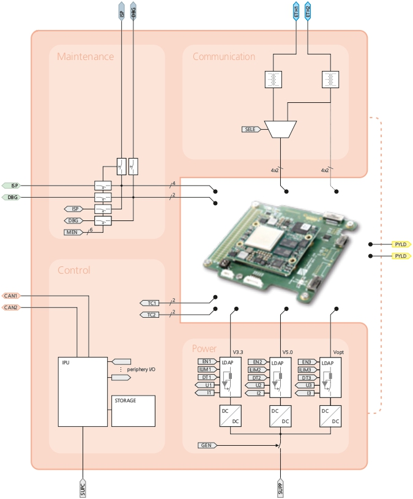
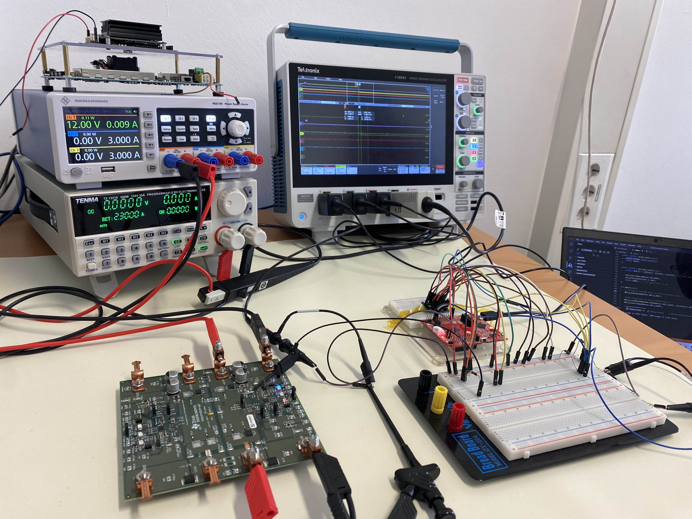
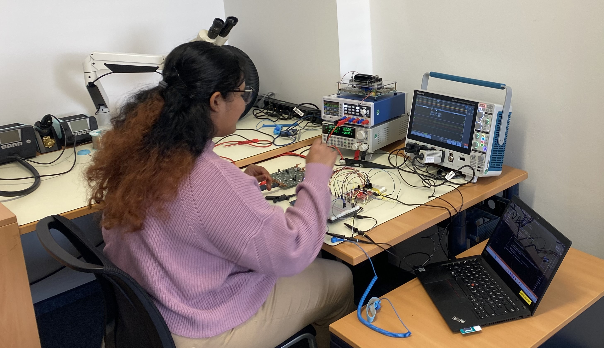
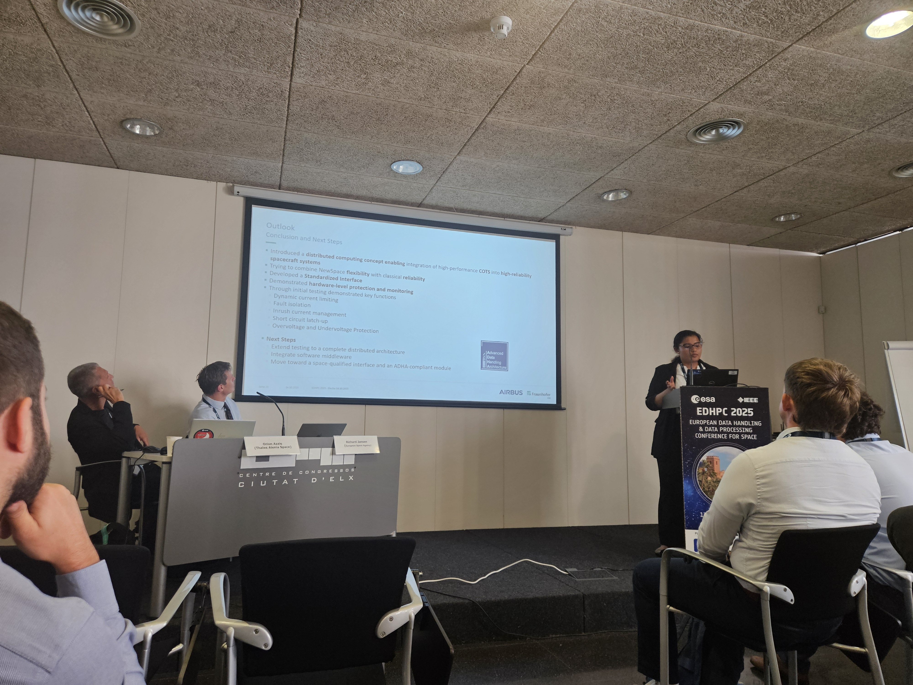
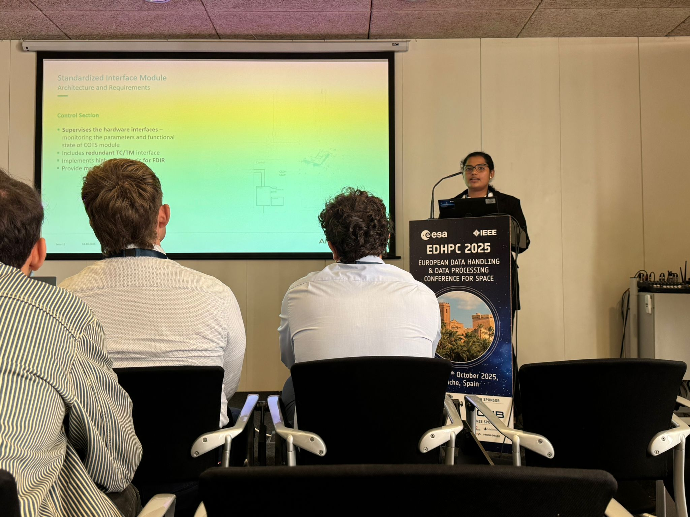

# Distributed High-Performance Onboard Computer (OBC) — Standardized Interface Module  
**Master’s Thesis | Fraunhofer Institute (EMI)** · **03/2025 – 11/2025**

> 🔒 **Confidentiality Note**  
This work was carried out at Fraunhofer EMI. To respect IP and project confidentiality, this repository contains **only publicly shareable, high-level information**.  
No proprietary schematics, PCB layout files, firmware, or internal reports are included.

---

## Overview
This project focuses on the **hardware design and implementation of a standardized interface module** to integrate **COTS processors** into **high-reliability distributed onboard computers** for space systems. The goal is to enable a robust, testable, and fault-aware interface layer with reliable power distribution and multi-protocol communication.

---

## System Architecture (High-Level)

---

## What I Worked On
- Requirements engineering and interface definition for a standardized OBC interface module
- **Fault-tolerant power paths** and regulated rails suitable for distributed computing architectures
- **Multi-protocol communication interfaces** for data exchange and supervision:
  - Ethernet, CAN
  - SPI, UART, I²C (for peripheral interfaces and monitoring)
- **MCU-based supervision** concepts and non-volatile logging for recovery workflows (high-level)
- Component selection and design trade-offs aligned with reliability and testability goals

---

## Project Scope & Status
Due to project scope and timeline constraints, this thesis focused on the **design, simulation, and verification planning** phases.  
Physical PCB fabrication and full hardware bring-up were planned for subsequent project phases and are not included here.

---

## Design & Verification Workflow
### Schematic & PCB Development
- Schematic capture and PCB design using **Altium Designer**
- Design carried out with attention to **Design for Manufacturability (DFM)** and **Design for Testability (DFT)** principles, including:
  - Clear separation of power, digital, and interface domains
  - Test-point accessibility for power rails and key signals
  - Interface visibility and probing considerations for bring-up and validation
- Focus on interface robustness, reliability, and test accessibility  
*(Detailed design files are not shared due to confidentiality.)*

### Simulation
- Circuit validation using **LTSpice / PSpice**, including power-path and interface-level checks
- Simulation-driven refinement of **power-path protection concepts**, covering:
  - Overvoltage and overcurrent protection behavior
  - Short-circuit detection and response (high-level)
  - Isolation and fault containment considerations

---

## Testing & Validation
I followed a **prototype-based testing and validation approach** aligned with space electronics development practices, focusing on early risk reduction and design verification prior to final hardware fabrication.

- Bench-level validation of power and interface concepts using development boards and breadboard prototypes
- **MCU-based testing** of major circuit concepts related to:
  - Protection and fault detection behavior (high-level)
  - FDIR-related supervision concepts
- Power-path verification and stability checks under representative operating conditions
- Hardware debugging and root-cause analysis during iterative prototyping
- **Python-based automated measurements** to assess repeatability, stability, and consistency across test runs

### Lab Setup (Examples)
- 
- 

---

## Publication & Conference
A part of this work was presented at **European Data Handling & Data Processing Conference (EDHPC) 2025** and accepted for publication in the **IEEE proceedings**.

- 📄 **Abstract (PDF):** [EDHPC 2025 Abstract](Document/Abstract_IEEE%20EDHPC.pdf)

  

### Conference Presentation
- 
- 

---

## Tools & Skills Demonstrated
- **Hardware development:** requirements → architecture → schematic → PCB → validation
- **Interfaces:** Ethernet, CAN, SPI, UART, I²C
- **Simulation:** LTSpice, PSpice
- **PCB design:** Altium Designer (4-layer design)
- **Testing:** oscilloscope, multimeter, power analysis tools
- **Automation:** Python for repeatable measurement workflows
- **MCU programming:** C programming for validation and supervision tasks using **Texas Instruments Code Composer Studio**

---

## What This Project Shows
- End-to-end ownership of a hardware development workflow
- Engineering judgment around reliability, testability, and interface robustness
- Hands-on validation skills and comfort working close to real hardware
- Ability to rapidly learn and apply new tools and methodologies, including schematic capture, PCB design, simulation, and automated testing, in an industry research environment

