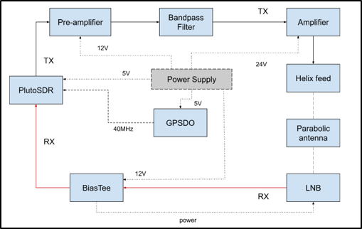
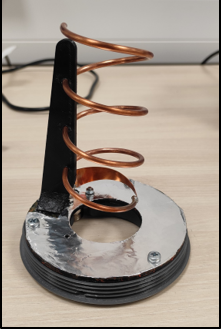

# QO-100 Satellite Transceiver — RF System Design & Testing  
**Julius-Maximilians University of Würzburg** · **10/2023 – 02/2024**

---

## Overview
This project involved the **design, implementation, and testing of a ground-based transceiver system** for communication via **QO-100 (Es’hail-2)**, the first geostationary satellite carrying an amateur radio payload.

The objective was to establish **reliable two-way communication (QSO)** over the satellite by designing and integrating RF hardware, antennas, amplifiers, frequency references, and SDR-based signal processing.

---

## System Architecture
The transceiver system consists of separate **uplink and downlink RF chains**, integrated around an **SDR-based radio front-end**.

### Key Elements
- **Software Defined Radio:** ADALM-PlutoSDR
- **Uplink:** 2.4 GHz (RHCP)
- **Downlink:** 10.4 GHz (via LNB downconversion)
- **Antenna System:** Parabolic dish with custom helix feed
- **External frequency reference:** GPS-disciplined oscillator (GPSDO)

---

## RF Hardware & Antenna Work

### Helix Feed Design & Tuning
- Designed and constructed a **right-hand circularly polarized (RHCP) helix feed** for the uplink
- Fabricated using **3D-printed mechanical parts**
- Tuned and characterized using spectrum analyzer (VNA mode)
- Achieved:
  - S11 better than **–25 dB** at target frequency
  - VSWR ≈ **1.1–1.4** in the QO-100 narrowband region

---

## Transmission Chain & Power Analysis
- Multi-stage TX amplification:
  - SDR output → pre-amplifier → band-pass filter → power amplifier
- Performed **link budget and power chain calculations**
- Identified discrepancies between datasheet-based estimates and real-world performance
- Conducted **measured power verification** using spectrum analyzer
- Achieved uplink transmit power in the **multi-watt range**, sufficient for QO-100 narrowband operation

---

## SDR & Frequency Stability Engineering

### PlutoSDR Characterization
- Measured output power vs drive level
- Verified SDR behavior against published reference measurements

### Frequency Stability Improvement
- Identified **frequency drift limitations** of the onboard TCXO
- Performed **hardware modification** of the PlutoSDR:
  - Removed internal TCXO
  - Added external SMA reference input
- Integrated **GPSDO (40 MHz reference)**
- Reduced frequency drift from **hundreds of Hz/min** to **tens of Hz over several minutes**, enabling stable narrowband operation

---

## Testing & Validation

### Reception Testing
- Antenna alignment and satellite acquisition
- Verification of beacon reception and SNR levels
- Comparison of performance with and without GPSDO reference
- Observed environmental effects (e.g. wind-induced pointing disturbances)

🎥 **QO-100 Downlink Reception Test**  
[Watch video](https://youtu.be/77A0BeNqzKY)

### Transmission Testing
- Stepwise validation of TX chain
- Full-duplex testing
- Voice and tone transmission verification
- Successful **QSO established via QO-100** with an external amateur radio operator

🎥 **QO-100 Uplink Transmission Test**  
[Watch video](https://youtu.be/yl5k81lkDBI)

---

## External Reference
This project was carried out as part of the *Satellite Telecommunication Lab* at Julius-Maximilians-University Würzburg.

The development and commissioning of the QO-100 ground station was featured on the official university website, documenting the successful setup and first on-air operations of the station:

🔗 **Amateur radio operators from DL0JMU are QRV on QO-100**  
[Official University Article – 30.04.2024](https://www.informatik.uni-wuerzburg.de/dl0jmu/aktuelles/single/news/funkamateure-von-dl0jmu-qrv-auf-qo-100/) 

---

## Tools & Equipment Used
- **SDRConsole** software
- ADALM-PlutoSDR
- Spectrum analyzer (including VNA mode)
- RF power amplifiers and filters
- GPSDO (external frequency reference)
- RF antennas, LNAs, bias tees, and downconverters

---

## Engineering Skills Demonstrated
- RF system integration and debugging
- Antenna construction, tuning, and characterization
- Power budgeting and measurement-based validation
- Frequency stability analysis and mitigation
- Practical SDR-based communication testing
- End-to-end system thinking from RF hardware to signal reception

---

## What This Project Shows
- Strong hands-on experience with **RF and analog hardware**
- Ability to debug and improve real-world communication systems
- Comfort working with measurement equipment and imperfect environments
- Understanding of practical constraints in satellite communication links
- End-to-end ownership of a complex experimental RF system
